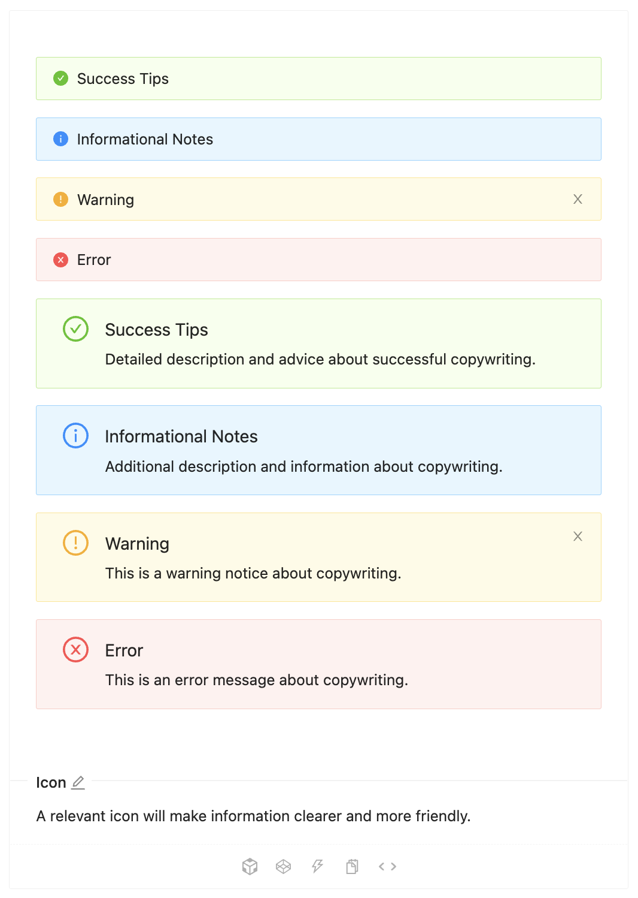
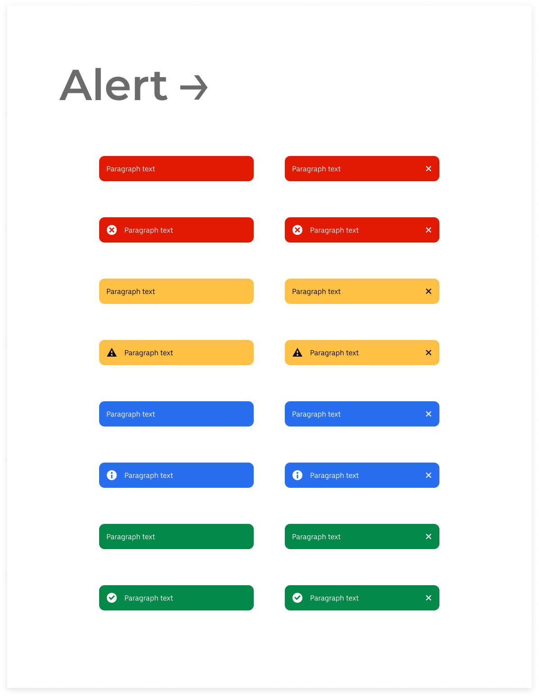

# POC Design System
This project is a POC to understand how can I will build a **White Label Design System** 

## Challenge
Criar um package com 1 componente que consegue mudar as cores de seu layout apenas modificando sua folha de **design tokens** e **component tokens**. 

- [x] Definir componente a ser criado
- [x] Definir arquitetura da Poc
- [ ] Definir uma folha de Design Tokens
- [ ] Definir quais as propriedades podem ser alterados pelos componente tokens
- [ ] Criar _**pub**_ de assets
- [ ] Criar componente
- [ ] Criar Sample app contendo pelo menos dois estilos diferentes

### O Componente 
O escolhido será o alert e ele deve contemplar os dois tipos de layout a baixo

<p align="center">
    
    
</p>

### Folha de Design tokens
A folha de design tokens nessa poc vai contemplar apenas as cores

```json
{
    "colors": {
        "feedback-error": {
            "value": "#E11900"
        },
        "feedback-warning": {
            "value": "#FFC043"
        },
        "feedback-success": {
            "value": "#048848"
        },
        "feedback-info": {
            "value": "#276EF1"
        },
        "neutral-dark-pure": {
            "value": "#000000"
        },
        "neutral-light-pure": {
            "value": "#000000"
        }
    }
}
```